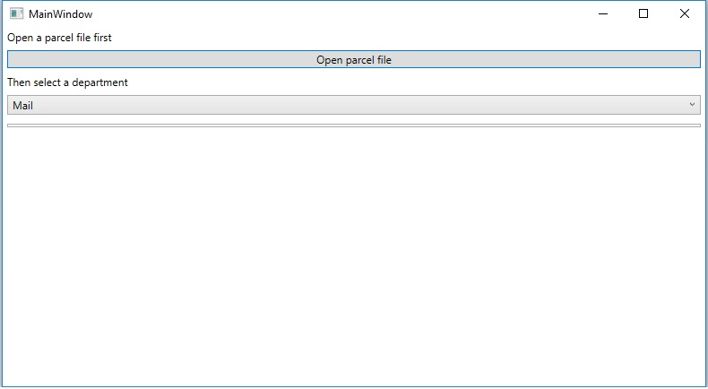

# Parcel app

ParcelApp MainWindow

This application offers a GUI for parsing an xml file containing parcels and filtering the parcels by the department.
The parcels shown are grouped by recipient, under the assumption that sending more deliveries is more expensive than insuring
a delivery composed of aggregated parcels. Other types of grouping (or no grouping) can easily be achieved, as described below. 

# Architectural choices

C# was used because it is simpler to develop a GUI application, parsing an XML file and build queries on collections using LINQ.

The application is implemented in the src directory, following the Models-View-ViewModel (MVVM) pattern:

- View (src/Views): contains MainWindow.xaml, implementing the main window layout.
- ViewModel (src/ViewModels): contains the data exposed to the View, and retrieved from the Model. 
The src/ViewModels/tools directory contains a utility class implementing the ICommand interface, required for wrapping the ReadParcels method.
- Model (src/Models): contains the logic for loading a file, parsing it, and applying department filters.

To promote extensibility, each filter implements a common interface (IFilter), composed of the GetDeliveries method. 
By doing so, new department filters can easily be added without modifying existing ones. 

Filters can also be composed, using the decorator pattern. 
An example is FilterByWeightGrouping, which decorates FilterGrouping. FilterByWeightGrouping uses FilterGrouping to group the parcels by receipient first. 
Parcels are then filtered by weight ranges, as requested by the requirements. The same decorator pattern is also used for FilterByLargerValuesGrouping.

Unit tests are implemented in a separate project under the test folder. Due to the limited scope of the assignment, only the Model filters are unit tested.

# Software dependencies
- Visual Studio 2019
- NUnit
- .NET Framework 